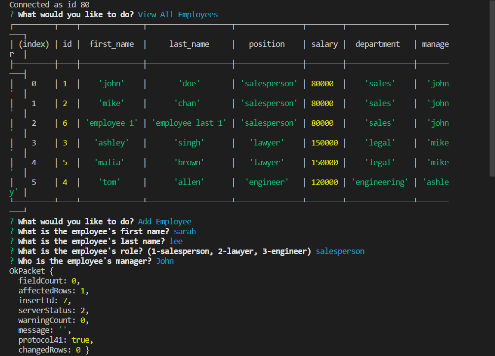

# Employee-Tracker

This application is used to track employees that are saved in a database. The tracker lists the employee's first and last name, their position, salary, department, and manager (if there is one). The current functions available are:

* Add Employee
* View All Employees
* Add Roles
* View All Roles
* Add Department
* View All Departments

## Technologies Used
* Javascript, jQuery, Node.js, MySQL

## Instructions
* Clone this repository
* Open the Git Bash terminal and redirect to the repository folder
* Run command "node tracker.js"